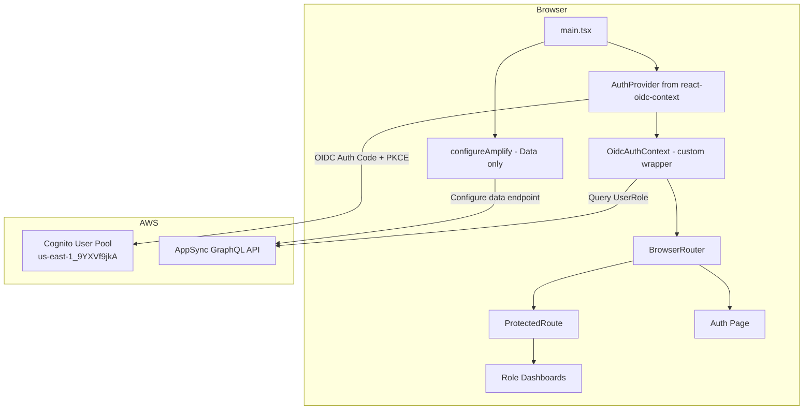

# Design Document: OIDC Cognito Authentication

## Overview

This design replaces the current Amplify SDK authentication calls (`signIn`, `signOut`, `getCurrentUser`, etc.) with a standards-based OpenID Connect (OIDC) flow using `react-oidc-context` and `oidc-client-ts`. The existing AWS Cognito User Pool remains the identity provider — we change only the client-side authentication mechanism from Amplify Auth SDK to OIDC Authorization Code Flow with PKCE.

**Key design decisions:**

1. **Drop-in replacement pattern** — The new `AuthContext` exposes the same interface (`user`, `userRole`, `loading`, `signIn`, `signOut`) so existing consumers (ProtectedRoute, Auth page, dashboards) continue working with minimal changes.
2. **Coexistence with Amplify Data** — The Amplify SDK is still used for AppSync/GraphQL data operations. Only the `aws-amplify/auth` imports are removed. The `configureAmplify()` call remains to configure the data layer.
3. **OIDC library handles token lifecycle** — Token storage, silent refresh, and session restoration are delegated entirely to `oidc-client-ts` via `react-oidc-context`.
4. **Role resolution stays on the data layer** — After OIDC authentication, the UserRole model is queried through Amplify Data (AppSync) exactly as before.

## Architecture



### Component Hierarchy (main.tsx)

```
configureAmplify() ← executes before render (data layer only)
│
└── <AuthProvider> (react-oidc-context)
    └── <OidcAuthProvider> (custom context with role resolution)
        └── <Web3Provider>
            └── <TooltipProvider>
                └── <BrowserRouter>
                    └── <Routes>
                        ├── / → Index
                        ├── /auth → Auth
                        ├── /rider-dashboard → ProtectedRoute → RiderDashboard
                        └── ...
```

## Components and Interfaces

### 1. OIDC Configuration Module

**File:** `src/integrations/oidc/config.ts`

Centralizes all OIDC client settings. Exports a `UserManagerSettings`-compatible object for `react-oidc-context`.

```typescript
import type { UserManagerSettings } from 'oidc-client-ts';

export const oidcConfig: UserManagerSettings = {
  authority: 'https://cognito-idp.us-east-1.amazonaws.com/us-east-1_9YXVf9jkA',
  client_id: '7u0frbk65upesqqvd90jjaictl',
  redirect_uri: window.location.origin,
  post_logout_redirect_uri: window.location.origin,
  response_type: 'code',
  scope: 'aws.cognito.signin.user.admin email openid phone profile',
  automaticSilentRenew: true,
  accessTokenExpiringNotificationTimeInSeconds: 60,
  userStore: new WebStorageStateStore({ store: window.sessionStorage }),
};
```

**Rationale:**
- `window.location.origin` for redirect URIs satisfies Requirements 1.5 and 1.6 (dynamic origin).
- `automaticSilentRenew: true` plus the 60-second notification window satisfies Requirement 8.2.
- `WebStorageStateStore` with `sessionStorage` satisfies Requirement 8.1.

### 2. AuthProvider Wrapper (Entry Point Integration)

**File:** `src/main.tsx` (modified)

The entry point is restructured to:
1. Call `configureAmplify()` (async, for data layer).
2. Render the `react-oidc-context` `AuthProvider` as the outermost React provider.
3. Wrap with a custom `OidcAuthProvider` that adds role resolution.

```typescript
import { AuthProvider } from 'react-oidc-context';
import { oidcConfig } from './integrations/oidc/config';
import { OidcAuthProvider } from './contexts/OidcAuthContext';

configureAmplify(); // Amplify data layer - executes before render

createRoot(document.getElementById('root')!).render(
  <AuthProvider {...oidcConfig}>
    <OidcAuthProvider>
      <App />
    </OidcAuthProvider>
  </AuthProvider>
);
```

**Coexistence with Amplify:** The `configureAmplify()` call configures `Amplify.configure()` for the data/AppSync endpoint only. The OIDC provider manages auth state independently. Both share the same Cognito User Pool but through different protocols — Amplify Data uses the Cognito token for AppSync authorization (passed via custom headers), while OIDC manages the token lifecycle.

### 3. Custom Auth Context (OidcAuthContext)

**File:** `src/contexts/OidcAuthContext.tsx`

This context wraps `react-oidc-context`'s `useAuth` hook and adds:
- User object extraction from ID token claims.
- Role resolution via Amplify Data (UserRole model query).
- A stable interface matching the existing `AuthContextType`.

```typescript
interface AuthUser {
  id: string;        // from `sub` claim
  email: string;     // from `email` claim
  fullName?: string; // from `name` claim
}

type AppRole = 'rider' | 'investor' | 'admin' | 'offsetter';

interface AuthContextType {
  user: AuthUser | null;
  loading: boolean;
  userRole: AppRole | null;
  signIn: () => void;           // triggers OIDC redirect
  signOut: () => void;          // ends session + redirect
  error: string | null;         // OIDC error message
}
```

**Role Resolution Flow:**
1. `react-oidc-context` resolves the OIDC session (from storage or callback).
2. When `oidcUser` becomes available, extract `sub` from ID token.
3. Query `client.models.UserRole.list({ filter: { userId: { eq: sub } } })`.
4. Set `userRole` to `data[0].role.toLowerCase()` or `null`.

**Loading State:** `loading = oidcAuth.isLoading || roleQueryInProgress`

### 4. ProtectedRoute Component

**File:** `src/components/ProtectedRoute.tsx` (modified)

Updated to use the new `useAuth` from `OidcAuthContext`. The interface remains identical:

```typescript
interface ProtectedRouteProps {
  children: React.ReactNode;
  allowedRoles?: AppRole[];
}
```

**Behavior:**
- While `loading` → show loading indicator.
- If `!user` → redirect to `/auth` with `replace: true`.
- If `allowedRoles` specified and `userRole` not in list → redirect to `/auth`.
- If `allowedRoles` specified and `userRole` is `null` → redirect to `/auth`.
- If no `allowedRoles` → any authenticated user may access.
- Otherwise → render children.

### 5. Sign-In / Sign-Out Integration

**Sign-In (Auth Page):**
- The form-based email/password flow is replaced by a single "Sign In" button.
- Clicking triggers `signIn()` → `oidcAuth.signinRedirect()` → redirects to Cognito Hosted UI.
- On return, the callback is processed automatically by `react-oidc-context`.
- After role resolution, user is redirected to their role-specific dashboard.

**Sign-Out:**
- `signOut()` → `oidcAuth.signoutRedirect({ post_logout_redirect_uri: window.location.origin })`.
- Clears all local state (`userRole`, tokens from sessionStorage).
- Even if the end-session endpoint fails, local cleanup still occurs.

### 6. Callback Handling

Handled transparently by `react-oidc-context`:
- On app load, if URL contains `code` and `state` params, the library exchanges for tokens.
- After exchange, it removes the params from the URL via `history.replaceState`.
- State parameter validation and PKCE verification are built into `oidc-client-ts`.
- On failure, the error is surfaced via `oidcAuth.error`.

### 7. Initialization Timeout & Retry

**Provider Initialization Timeout (10s):**
A wrapper component monitors `oidcAuth.isLoading`. If it remains true for >10 seconds, force resolve to unauthenticated state.

**Authority Endpoint Retry (Requirement 1.8):**
`oidc-client-ts` fetches the OIDC discovery document on init. A custom `metadataService` configuration or an `onSigninCallback` error handler retries up to 3 times with 2-second delays if the authority is unreachable.

## Data Models

### AuthUser (Client-Side)

| Field     | Type              | Source                      |
|-----------|-------------------|-----------------------------|
| id        | string            | ID token `sub` claim        |
| email     | string            | ID token `email` claim      |
| fullName  | string (optional) | ID token `name` claim       |

### UserRole (Amplify Data / DynamoDB)

| Field   | Type   | Values                              |
|---------|--------|-------------------------------------|
| userId  | ID     | Cognito user `sub`                  |
| role    | Enum   | ADMIN, RIDER, INVESTOR, OFFSETTER   |

### Token Storage (sessionStorage)

| Key Pattern                        | Content                    |
|------------------------------------|----------------------------|
| `oidc.user:{authority}:{client_id}` | JSON: id_token, access_token, refresh_token, profile |

### OIDC Configuration (Static)

| Parameter                     | Value                                                              |
|-------------------------------|--------------------------------------------------------------------|
| authority                     | `https://cognito-idp.us-east-1.amazonaws.com/us-east-1_9YXVf9jkA` |
| client_id                     | `7u0frbk65upesqqvd90jjaictl`                                       |
| response_type                 | `code`                                                             |
| scope                         | `aws.cognito.signin.user.admin email openid phone profile`         |
| redirect_uri                  | `window.location.origin`                                           |
| post_logout_redirect_uri      | `window.location.origin`                                           |
| token storage                 | sessionStorage                                                     |
| silent renew trigger          | 60 seconds before expiry                                           |


## Correctness Properties

*A property is a characteristic or behavior that should hold true across all valid executions of a system — essentially, a formal statement about what the system should do. Properties serve as the bridge between human-readable specifications and machine-verifiable correctness guarantees.*

### Property 1: Token Claim Extraction Preserves Identity

*For any* OIDC ID token containing a `sub` string, an `email` string, and an optional `name` string, the `extractUser` function SHALL produce an `AuthUser` where `id` equals the `sub` claim, `email` equals the `email` claim, and `fullName` equals the `name` claim (or undefined if absent).

**Validates: Requirements 3.1, 6.2**

### Property 2: Role Resolution Lowercasing

*For any* UserRole record with a `role` field containing one of the enum values (ADMIN, RIDER, INVESTOR, OFFSETTER), the resolved `App_Role` SHALL equal the role string converted to lowercase.

**Validates: Requirements 4.1**

### Property 3: Route Access Control Decision

*For any* combination of authentication state (`user`: present or null), `userRole` (one of the four roles or null), and `allowedRoles` (a subset of roles or undefined), the ProtectedRoute SHALL render child content if and only if: (1) `user` is not null, AND (2) either `allowedRoles` is undefined/empty OR `userRole` is contained in `allowedRoles`.

**Validates: Requirements 5.1, 5.2, 5.4, 5.5, 5.6**

## Error Handling

### OIDC Provider Initialization

| Scenario | Handling |
|----------|----------|
| Authority endpoint unreachable | Retry up to 3 times with 2s delay. After 3 failures, display error banner. |
| Initialization timeout (>10s) | Force resolve to unauthenticated state, render app normally. |
| Invalid/corrupted stored tokens | `oidc-client-ts` discards invalid tokens, resolves as unauthenticated. |

### Token Exchange (Callback)

| Scenario | Handling |
|----------|----------|
| State parameter mismatch | Reject callback, set error state, display error on Auth page. |
| Token exchange network failure | Set user to unauthenticated, expose error via Auth_Manager. |
| PKCE verification failure | Same as state mismatch — reject and surface error. |

### Silent Token Refresh

| Scenario | Handling |
|----------|----------|
| Refresh token expired | Clear session, set user to unauthenticated. User must re-login. |
| Network error during refresh | Same as expired — clear session, require re-login. |
| Refresh during sign-out | No-op. `automaticSilentRenew` is disabled during sign-out flow. |

### Role Resolution

| Scenario | Handling |
|----------|----------|
| AppSync query fails (network) | Set `userRole` to null. User is authenticated but has no role (limited access). |
| No UserRole record found | Set `userRole` to null. Redirect to default landing page. |
| Multiple UserRole records | Use the first record's role (matching existing behavior). |

### Sign-Out

| Scenario | Handling |
|----------|----------|
| End-session endpoint unreachable | Still clear local tokens and state, redirect to origin. |
| SessionStorage clear fails | Log error, proceed with redirect (best-effort cleanup). |

## Testing Strategy

### Unit Tests (Vitest + React Testing Library)

**Configuration module:**
- Assert each field of the OIDC config object matches expected values (smoke tests for Req 1.1–1.6, 8.1).

**OidcAuthContext:**
- Mock `react-oidc-context`'s `useAuth` hook return values.
- Test user extraction from various token claim shapes.
- Test role resolution with mocked Amplify client responses.
- Test loading states during initialization and role fetching.
- Test error state exposure on OIDC failures.
- Test signIn/signOut function delegation.

**ProtectedRoute:**
- Mock auth context with various user/role/loading combinations.
- Verify correct rendering (children vs loading vs redirect).

**Auth Page:**
- Verify sign-in button rendered for unauthenticated state.
- Verify error message display on auth failure.
- Verify role-based redirect after authentication.

### Property-Based Tests (Vitest + fast-check)

Property-based testing is appropriate for this feature because:
- Token claim extraction is a pure function with a large input space (arbitrary strings).
- Role resolution lowercasing is a pure transformation.
- Route access control is a pure decision function over a combinatorial input space.

**Library:** `fast-check` (standard PBT library for TypeScript/Vitest)

**Configuration:**
- Minimum 100 iterations per property test.
- Each test tagged with: `Feature: oidc-cognito-auth, Property {N}: {title}`

**Properties to implement:**
1. Token claim extraction (arbitrary string claims → correct AuthUser).
2. Role resolution lowercasing (arbitrary enum value → lowercase string).
3. Route access control decision (arbitrary user state × role × allowedRoles → correct render/redirect decision).

### Integration Tests

- Verify Amplify data layer continues functioning after OIDC provider mounts.
- Verify full callback flow with mocked Cognito endpoints.
- Verify session restoration from pre-populated sessionStorage.

### E2E Tests (Playwright — existing setup)

- Full sign-in flow against Cognito (with test user).
- Protected route access with correct/incorrect roles.
- Sign-out and session cleanup verification.
- Token refresh behavior (accelerated token expiry in test env).
