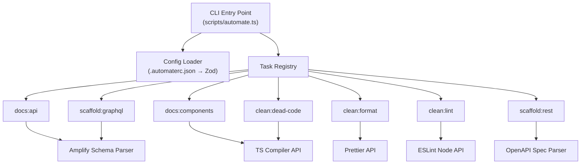
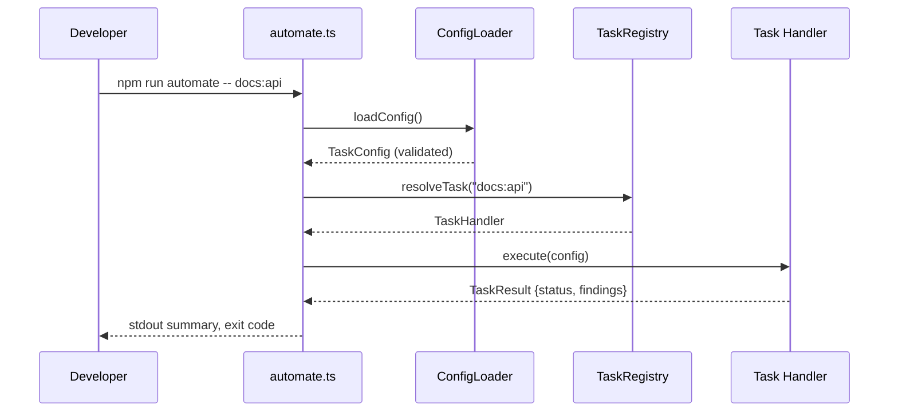

# Design Document: Task Automation

## Overview

The Task Automation system is an internal developer tooling suite that runs as CLI commands within the existing Vite/TypeScript project. It provides three categories of automated tasks:

1. **Documentation Generation** — Extracts API docs from the Amplify data schema and component docs from TSX prop interfaces
2. **Code Cleanup** — Prettier formatting, ESLint auto-fix, and static dead-code detection
3. **API Integration Scaffolding** — Generates typed GraphQL hook wrappers from the Amplify schema and REST clients from OpenAPI specs

The system is implemented as a set of Node.js scripts using `tsx` for direct TypeScript execution, invoked through a unified `npm run automate` CLI entry point. Configuration is managed via a `.automaterc.json` file with Zod schema validation.

### Design Decisions

- **`tsx` as runtime**: Avoids a separate compilation step for automation scripts. Scripts run directly as ESM TypeScript modules.
- **Zod for config validation**: Already a project dependency. Provides runtime schema validation with detailed error messages including path information.
- **AST parsing via TypeScript Compiler API**: Used for component prop extraction and dead-code analysis. No additional dependency needed — TypeScript is already in devDependencies.
- **In-process task execution**: Tasks run in the same Node.js process (not spawned subprocesses) for performance and shared config state. Exceptions and exit codes are handled programmatically.
- **Hash-based incremental generation**: GraphQL scaffolder stores per-model hashes in a `.automate-cache.json` file to skip unchanged models on re-runs.

## Architecture



### Execution Flow



## Components and Interfaces

### CLI Entry Point (`scripts/automate.ts`)

The top-level script registered as `npm run automate`. Responsible for:
- Parsing CLI arguments (task names, flags like `--ci`, `--timeout`, `--json`)
- Loading and validating configuration
- Resolving task names against the registry
- Executing tasks sequentially (or all in CI mode regardless of failures)
- Formatting output (human-readable or JSON in CI mode)
- Setting process exit code

```typescript
interface CLIArgs {
  tasks: string[];         // Comma-separated task names parsed into array
  ci: boolean;            // --ci flag for JSON output mode
  timeout: number;        // --timeout in seconds (10–3600, default 120)
  json: boolean;          // --json flag (for dead-code report)
}
```

### Config Loader (`scripts/lib/config.ts`)

Reads and validates `.automaterc.json` using Zod schemas.

```typescript
import { z } from 'zod';

const TaskConfigSchema = z.object({
  enabled: z.boolean().default(true),
  outputDir: z.string().optional(),
  include: z.array(z.string()).optional(),  // glob patterns
  exclude: z.array(z.string()).optional(),
}).passthrough().strict();

const AutomateConfigSchema = z.object({
  tasks: z.record(z.string(), TaskConfigSchema).default({}),
  openApiSpec: z.string().optional(),
}).strict();

type AutomateConfig = z.infer<typeof AutomateConfigSchema>;
```

### Task Registry (`scripts/lib/registry.ts`)

Maps task identifiers to handler functions and descriptions.

```typescript
interface TaskDefinition {
  name: string;
  description: string;
  handler: (config: AutomateConfig, flags: CLIFlags) => Promise<TaskResult>;
}

interface TaskResult {
  status: 'pass' | 'warning' | 'error';
  durationMs: number;
  findings: string[];
  summary: string;
}

type TaskRegistry = Map<string, TaskDefinition>;
```

### Amplify Schema Parser (`scripts/lib/schema-parser.ts`)

Parses the Amplify data schema file (`amplify/data/resource.ts`) using the TypeScript Compiler API to extract model definitions, fields, enums, authorization rules, and secondary indexes.

```typescript
interface ParsedModel {
  name: string;
  fields: ParsedField[];
  secondaryIndexes: SecondaryIndex[];
  authorizationRules: AuthRule[];
}

interface ParsedField {
  name: string;
  type: string;            // 'string' | 'id' | 'float' | 'boolean' | 'datetime' | 'json' | 'enum'
  required: boolean;
  defaultValue?: string;
  enumValues?: string[];   // Populated for inline enum definitions
}

interface SecondaryIndex {
  fields: string[];
}

interface AuthRule {
  identity: 'owner' | 'groups' | 'authenticated';
  groups?: string[];
  operations: ('create' | 'read' | 'update' | 'delete')[];
}

interface ParsedEnum {
  name: string;
  values: string[];
}

interface SchemaParseResult {
  models: ParsedModel[];
  enums: ParsedEnum[];
}
```

### Component Props Parser (`scripts/lib/component-parser.ts`)

Uses the TypeScript Compiler API to scan `.tsx` files, identify exported React components, and extract their props interfaces.

```typescript
interface ParsedComponent {
  name: string;
  filePath: string;
  group: string;            // subdirectory name or 'shared'
  props: ParsedProp[];
  hasProps: boolean;
}

interface ParsedProp {
  name: string;
  type: string;             // TypeScript type as string
  required: boolean;
  defaultValue?: string;
  description?: string;     // From JSDoc
}
```

### Dead Code Analyzer (`scripts/lib/dead-code.ts`)

Performs static analysis using the TypeScript Compiler API to build a module dependency graph and identify unreferenced exports, unused imports, and orphaned components.

```typescript
interface DeadCodeEntry {
  filePath: string;
  symbolName: string;
  category: 'unused-export' | 'unused-import' | 'unused-component';
  lineNumber?: number;
  migrationCandidate: boolean;
}

interface DeadCodeReport {
  entries: DeadCodeEntry[];
  summary: {
    unusedExports: number;
    unusedImports: number;
    unusedComponents: number;
    migrationCandidates: number;
  };
}
```

### GraphQL Hook Generator (`scripts/lib/graphql-scaffolder.ts`)

Generates typed React Query hook wrappers that use the Amplify client for CRUD operations.

```typescript
interface GeneratedHookFile {
  modelName: string;
  fileName: string;          // e.g., "useCarbonCredit.ts"
  content: string;
  hash: string;              // SHA-256 of model definition for incremental builds
}
```

### REST Client Generator (`scripts/lib/rest-scaffolder.ts`)

Parses OpenAPI 3.x specs and generates typed client functions with Zod validation schemas.

```typescript
interface OpenAPIOperation {
  method: string;
  path: string;
  operationId: string;
  parameters: OperationParam[];
  requestBody?: SchemaRef;
  responses: Record<string, SchemaRef>;
}

interface GeneratedRESTClient {
  functions: GeneratedFunction[];
  zodSchemas: GeneratedZodSchema[];
  typeInterfaces: string;
}
```

## Data Models

### Configuration Schema (`.automaterc.json`)

```json
{
  "tasks": {
    "docs:api": {
      "enabled": true,
      "outputDir": "docs/api"
    },
    "docs:components": {
      "enabled": true,
      "outputDir": "docs/components"
    },
    "clean:format": {
      "enabled": true,
      "include": ["src/**/*.{ts,tsx}"]
    },
    "clean:lint": {
      "enabled": true
    },
    "clean:dead-code": {
      "enabled": true
    },
    "scaffold:graphql": {
      "enabled": true,
      "outputDir": "src/hooks/generated"
    },
    "scaffold:rest": {
      "enabled": false,
      "outputDir": "src/integrations/rest"
    }
  },
  "openApiSpec": "specs/openapi.yaml"
}
```

### Cache File (`.automate-cache.json`)

Used by the GraphQL scaffolder for incremental generation:

```json
{
  "modelHashes": {
    "CarbonCredit": "a1b2c3...",
    "Profile": "d4e5f6...",
    "Ride": "g7h8i9..."
  },
  "lastRun": "2024-01-15T10:30:00.000Z"
}
```

### CI Mode JSON Output

```json
{
  "results": [
    {
      "task": "docs:api",
      "status": "pass",
      "durationMs": 1200,
      "findings": []
    },
    {
      "task": "clean:dead-code",
      "status": "warning",
      "durationMs": 3400,
      "findings": ["Unused export: src/services/blockscout.ts#getTokenBalance"]
    }
  ],
  "totalDurationMs": 4600,
  "exitCode": 1
}
```

## Correctness Properties

*A property is a characteristic or behavior that should hold true across all valid executions of a system — essentially, a formal statement about what the system should do. Properties serve as the bridge between human-readable specifications and machine-verifiable correctness guarantees.*

### Property 1: CLI argument routing correctness

*For any* input string that is not a recognized task name (including empty/whitespace-only strings), the Task Runner SHALL route to the appropriate handler: displaying the task list on stdout and exiting 0 for empty/whitespace input, or printing an error with valid task names to stderr and exiting 1 for non-matching strings.

**Validates: Requirements 1.2, 1.3**

### Property 2: Sequential task failure halts remaining tasks

*For any* comma-separated sequence of valid task names where task at position N fails, the Task Runner SHALL execute exactly N tasks (positions 0 through N), skip all tasks at positions > N, and exit with code 1.

**Validates: Requirements 1.4, 1.5**

### Property 3: Config validation rejects invalid input

*For any* JSON string that is either syntactically invalid or contains unrecognized keys or values failing type validation, the Automation Engine SHALL report an error identifying the problem (line number for syntax errors, key path for schema errors) and exit with a non-zero code.

**Validates: Requirements 2.5, 2.6**

### Property 4: Task enablement follows config flags

*For any* configuration object mapping task identifiers to boolean `enabled` flags, only tasks with `enabled: true` (or tasks not present in config, since they default to enabled) SHALL be available for execution.

**Validates: Requirements 2.3**

### Property 5: API doc generation produces correctly named files with complete content

*For any* valid Amplify schema containing N models, the `docs:api` task SHALL produce exactly N Markdown files named in kebab-case, where each file contains all field names, field types, required status, default values, secondary indexes, and authorization rules for that model.

**Validates: Requirements 3.1, 3.2**

### Property 6: Enum documentation completeness

*For any* set of enum definitions in the Schema Source, the generated `enums.md` file SHALL contain every enum name and all its possible values.

**Validates: Requirements 3.4**

### Property 7: Generated file header format

*For any* file produced by the automation system, the first line SHALL contain a comment with a valid ISO 8601 timestamp and the relative path to the source schema file.

**Validates: Requirements 3.5**

### Property 8: Component prop extraction completeness

*For any* `.tsx` file exporting a React component with a typed props interface, the generated documentation SHALL list every prop's name, TypeScript type, required/optional status, and default value (when present in the destructuring signature).

**Validates: Requirements 4.1, 4.2**

### Property 9: JSDoc inclusion in component docs

*For any* component with JSDoc comments on its props interface or individual properties, the generated documentation SHALL include the description text alongside the corresponding prop entry.

**Validates: Requirements 4.3**

### Property 10: Component grouping by subdirectory

*For any* set of component files at various paths under `src/components/`, the generated documentation SHALL group each component by its immediate subdirectory name, with components in the root `src/components/` directory grouped under "shared."

**Validates: Requirements 4.4**

### Property 11: File exclusion filter correctness

*For any* file path, the Code Cleaner's file filter SHALL exclude paths matching `node_modules/`, `dist/`, `.amplify/`, and patterns listed in `.gitignore`, and include all other `.ts`/`.tsx` files.

**Validates: Requirements 5.4**

### Property 12: Dead code detection accuracy — unused exports

*For any* module graph where exported symbols exist that are not imported or referenced by any other file in the project (excluding `node_modules/` and `dist/`), the dead code detector SHALL report each such symbol with its file path and name, and SHALL NOT report symbols that are actually referenced.

**Validates: Requirements 6.1**

### Property 13: Dead code detection accuracy — unused imports

*For any* TypeScript file containing import statements where the imported binding is never referenced within that file, the dead code detector SHALL report the import name, file path, and line number.

**Validates: Requirements 6.2**

### Property 14: Migration candidate labeling

*For any* unused item detected in a file whose path matches `src/integrations/supabase/`, the dead code detector SHALL flag it with `migrationCandidate: true`, and SHALL NOT apply this flag to unused items at other paths.

**Validates: Requirements 6.4**

### Property 15: Dead code JSON report serialization round-trip

*For any* dead code analysis result, serializing it to `dead-code-report.json` and reading it back SHALL produce a structurally equivalent array of entries each containing file path, symbol name, category, and migration-candidate flag.

**Validates: Requirements 6.5**

### Property 16: GraphQL hook generation completeness

*For any* Amplify schema with N models, the GraphQL scaffolder SHALL produce exactly N TypeScript files (named `use{ModelName}.ts`), each containing exported hooks for list, get, create, update, and delete operations that import from `@/integrations/amplify/client` and include type-safe parameters matching the model's field definitions.

**Validates: Requirements 7.1, 7.2, 7.3, 7.4**

### Property 17: Incremental GraphQL generation

*For any* two consecutive schema versions where a subset of models have changed field definitions, authorization rules, or secondary indexes, the GraphQL scaffolder SHALL regenerate only the files corresponding to changed models and leave unchanged model files untouched.

**Validates: Requirements 7.6**

### Property 18: REST client generation from OpenAPI spec

*For any* valid OpenAPI 3.x specification with N unique operations (method + path combinations), the REST scaffolder SHALL generate exactly N exported async functions with typed parameters for path params, query params, and request body, plus corresponding TypeScript interfaces derived from the spec's schemas.

**Validates: Requirements 8.2, 8.6**

### Property 19: Zod schema generation from OpenAPI

*For any* request body or response schema defined in an OpenAPI specification, the REST scaffolder SHALL produce a Zod validation schema that correctly validates conforming objects and rejects non-conforming objects.

**Validates: Requirements 8.3**

### Property 20: REST client typed error on non-2xx response

*For any* non-2xx HTTP status code and response body, a generated REST client function SHALL throw a typed error containing both the status code and the response body.

**Validates: Requirements 8.7**

### Property 21: CI mode JSON output completeness

*For any* set of task execution results in CI mode, the JSON output SHALL contain one entry per task with task name, status (pass/warning/error), duration in milliseconds, and a findings array.

**Validates: Requirements 10.1**

### Property 22: CI mode continues on failure

*For any* sequence of tasks in CI mode where one or more tasks fail or time out, the Automation Engine SHALL execute ALL remaining tasks in the sequence before exiting with a non-zero code.

**Validates: Requirements 10.5**

### Property 23: Timeout validation bounds

*For any* `--timeout` value, the Automation Engine SHALL accept values in the range [10, 3600] and reject values outside this range.

**Validates: Requirements 10.3**

## Error Handling

### Configuration Errors

| Error | Behavior |
|-------|----------|
| `.automaterc.json` missing | Use defaults for all tasks (all enabled) |
| Invalid JSON syntax | Report line number + error nature, exit 1 |
| Valid JSON, invalid schema | Report key path + expected type via Zod error, exit 1 |

### Task Execution Errors

| Error | Behavior |
|-------|----------|
| Unknown task name | Print error + valid task list to stderr, exit 1 |
| Task throws unhandled exception | Catch at runner level, report task name + message, exit 1 |
| Task exceeds timeout (CI mode) | Terminate via AbortController signal, record timeout error |
| Schema source file missing | Report missing file path, exit 1 |
| OpenAPI spec invalid | Report validation failure location, exit 1 |
| Prettier parse failure on file | Skip file, warn to stdout, continue |
| File system permission error | Report file path, treat as task error |

### Sequential vs CI Mode Error Behavior

- **Sequential mode (default)**: First failure halts remaining tasks (fail-fast)
- **CI mode (`--ci`)**: All tasks execute regardless of failures; final exit code reflects worst status

### Graceful Degradation

- Dead code detection skips files that fail to parse (malformed TypeScript)
- Component doc generation includes components without props interfaces (marked as "no props")
- Formatting skips unparseable files with a warning

## Testing Strategy

### Property-Based Testing

This feature is well-suited for property-based testing because the core logic consists of:
- Pure transformation functions (schema → markdown, schema → TypeScript, OpenAPI → client code)
- Input validation with clear accept/reject boundaries
- Filtering/routing logic with deterministic behavior based on input characteristics

**Library**: [fast-check](https://github.com/dubzzz/fast-check) (TypeScript-native PBT library)

**Configuration**:
- Minimum 100 iterations per property test
- Each property test tagged with: `// Feature: task-automation, Property {N}: {title}`

**Key Property Test Generators**:
- Random Amplify-like schema definitions (models with random fields, enums, auth rules)
- Random TypeScript source files with prop interfaces
- Random module dependency graphs (for dead-code analysis)
- Random OpenAPI 3.x specs with varying operations and schemas
- Random `.automaterc.json` configs (valid and invalid)
- Random CLI argument strings (valid task names, invalid names, whitespace, comma-separated)

### Unit Tests (Example-Based)

Focused on specific scenarios and edge cases not covered by properties:

- Config loading with missing file (uses defaults)
- Output directory creation when missing
- File header timestamp format (specific ISO 8601 examples)
- Overwrite behavior for REST scaffolder
- Components without props interfaces
- Zero dead-code-items message
- ESLint remaining issues → exit code mapping

### Integration Tests

For subsystems that invoke external tools:

- Prettier formatting on real `.ts` files (2-3 examples)
- ESLint auto-fix on real files with known issues
- Full pipeline: schema → generated hooks → TypeScript compilation passes
- CI mode JSON output format with real task execution

### Test File Organization

```
scripts/
├── __tests__/
│   ├── properties/              # Property-based tests
│   │   ├── cli-routing.prop.ts
│   │   ├── config-validation.prop.ts
│   │   ├── schema-parser.prop.ts
│   │   ├── component-parser.prop.ts
│   │   ├── dead-code.prop.ts
│   │   ├── graphql-scaffolder.prop.ts
│   │   ├── rest-scaffolder.prop.ts
│   │   └── ci-mode.prop.ts
│   ├── unit/                    # Example-based unit tests
│   │   ├── config-loader.test.ts
│   │   ├── schema-parser.test.ts
│   │   ├── component-parser.test.ts
│   │   ├── dead-code.test.ts
│   │   └── scaffolder.test.ts
│   └── integration/             # Integration tests
│       ├── format.integration.ts
│       ├── lint.integration.ts
│       └── pipeline.integration.ts
├── lib/                         # Source modules
└── automate.ts                  # CLI entry point
```

### Test Runner

Vitest (already Vite-based project) with `vitest --run` for single execution. Add to `package.json`:

```json
{
  "scripts": {
    "test:automate": "vitest --run scripts/__tests__/",
    "test:automate:props": "vitest --run scripts/__tests__/properties/"
  }
}
```
